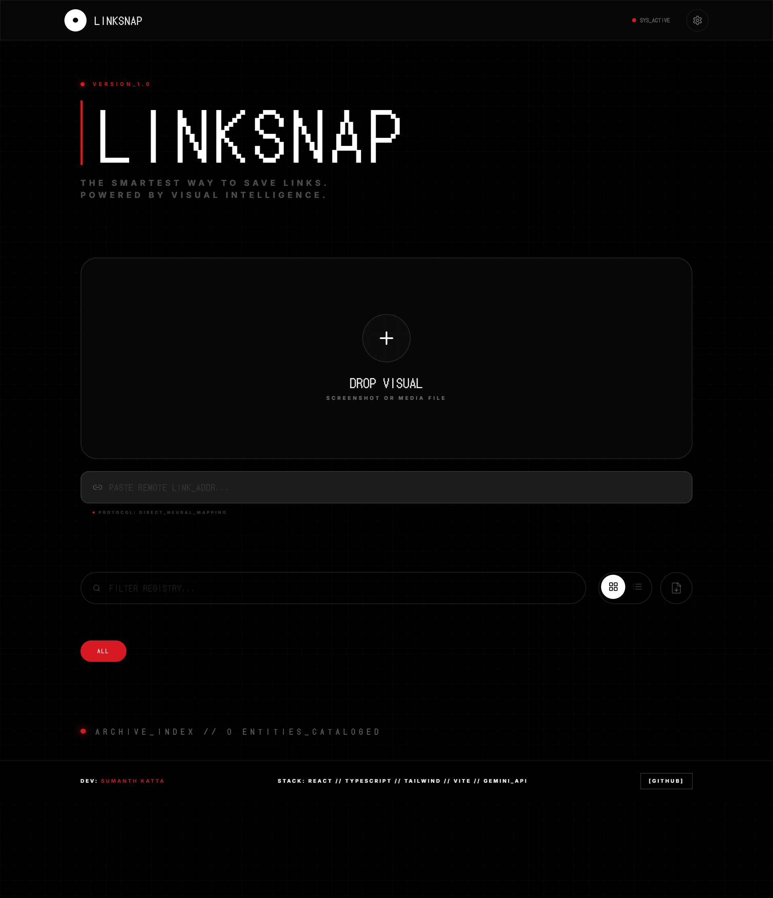

# 🔗 LinkSnap

### *The Smartest Way to Save Links - Powered by Visual Intelligence*

[](https://linksnap.netlify.app)
[](https://github.com/sumanthkatta-dev/linksnap)
[](LICENSE)
[](CONTRIBUTING.md)

-purple?style=for-the-badge)


> **The "Second Brain" for your screenshots.**
> Turn dead pixels into live, searchable links instantly using AI.

## 🚀 Try It Now
### [**🔗 Click Here to Launch LinkSnap**](https://sumanthkatta-dev.github.io/linksnap/)
*(No Account Needed. No Login. Just instant productivity.)*

---

## 🖼️ See It In Action


---

## 💡 The Problem vs. The Solution

| The Old Way (Dead Screenshots) ❌ | The LinkSnap Way (AI Vision) ✅ |
| :--- | :--- |
| You take a screenshot of a cool tool or article. | You upload the screenshot to LinkSnap. |
| It gets buried in your gallery forever. | **AI extracts the URL, Name, and Tech Stack.** |
| You can't search for it later. | It becomes **searchable** and **categorized**. |
| You have to type the link manually to visit it. | One click to **visit the site** or **copy the link**. |

---

## ✨ Why You'll Love It ("All Good Things")

### 🚫 No Sign-In Required
We believe in privacy and speed. You don't need to create an account, give us your email, or remember another password.
* **Your Data:** Stored 100% locally on your device (browser storage).
* **Your Keys:** You control your own API key. Nothing is stored on our servers.

### 🧠 Smarter Than Your Gallery
LinkSnap doesn't just save images; it **understands** them using Google's Gemini AI.
* **Auto-Categorization:** It knows if a screenshot is a *Developer Tool*, *Design Inspiration*, or an *Article*.
* **Tech Detective:** It can identify if a website was built with React, Tailwind, or Python just by looking at the screenshot.

### ⚡ "Nothing" Aesthetic & PWA
* **Cyberpunk UI:** Designed with the Retro-Futuristic "Nothing OS" style (Dot Matrix fonts, Red accents).
* **Works Offline:** Install it as an app on your phone or desktop. It works even without internet access (for viewing saved items).

---

## 🛠️ How It Works (3 Steps)
1.  **Snap:** Take a screenshot of any website, software, or resource.
2.  **Drop:** Open LinkSnap and drop the image.
3.  **Discover:** The AI instantly fills in the Title, URL, Description, and Tags.

---

## 🚀 Run It Locally (For Developers)

If you want to contribute or run your own version:

```bash
# 1. Clone the repo
git clone [https://github.com/sumanthkatta-dev/linksnap.git](https://github.com/sumanthkatta-dev/linksnap.git)

# 2. Install dependencies
npm install

# 3. Start the app
npm run dev

Built with ❤️ by Sumanth Katta

### 💻 Push the Update
Run these commands to update your GitHub repo with this new, user-friendly README:

```powershell
git add README.md
git commit -m "Updated README: Added Live Link, Problem/Solution, and No Sign-In highlight"
git push

Now your project looks like a real product: It solves a problem, it's easy to access, and it respects the user's privacy! 🟢

